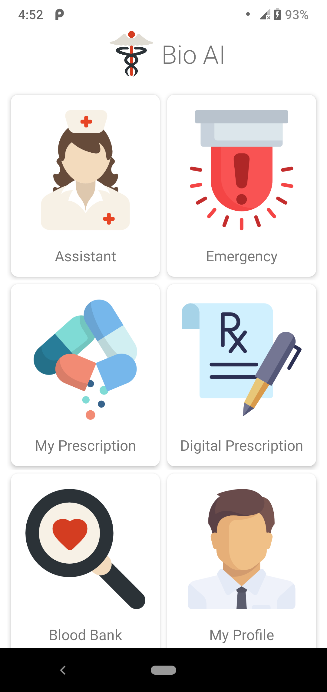
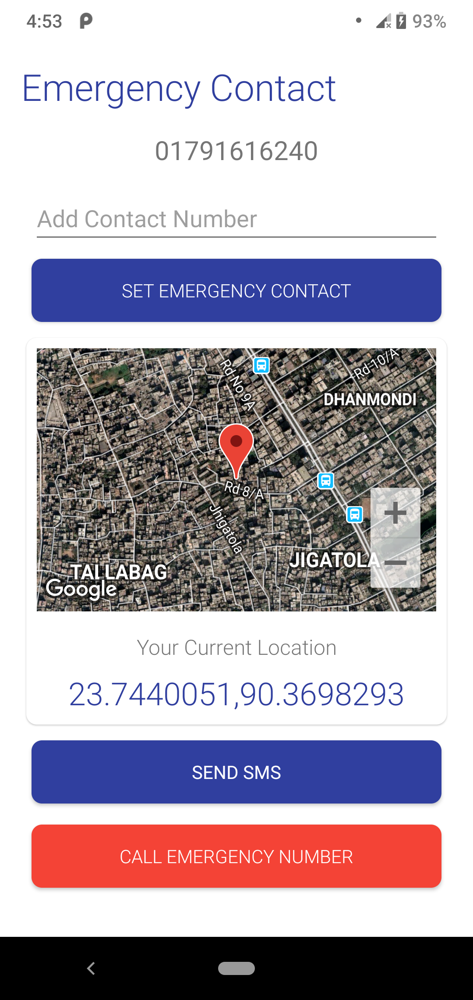
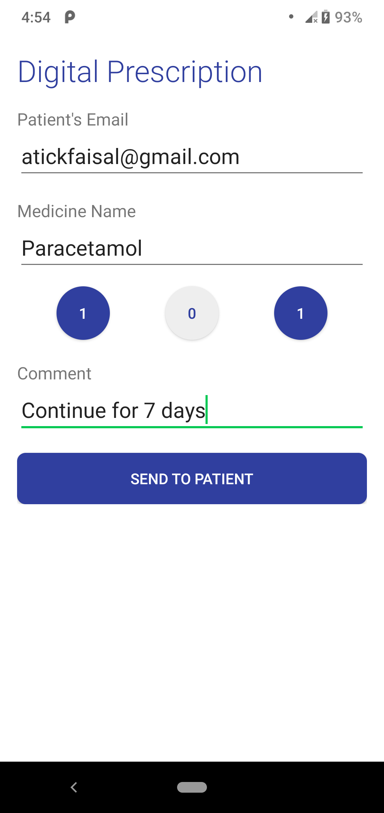
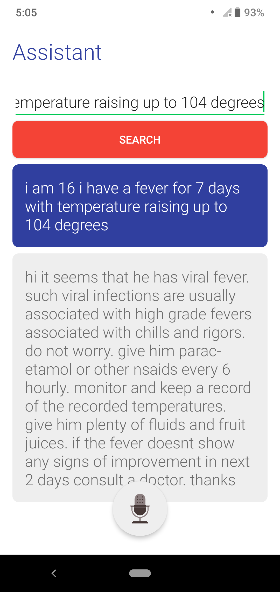
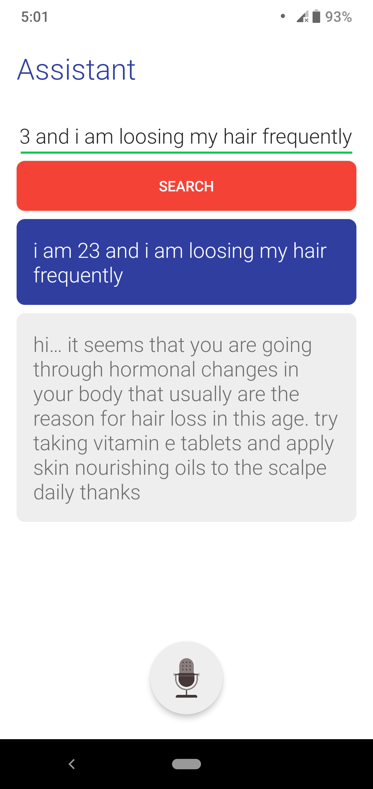
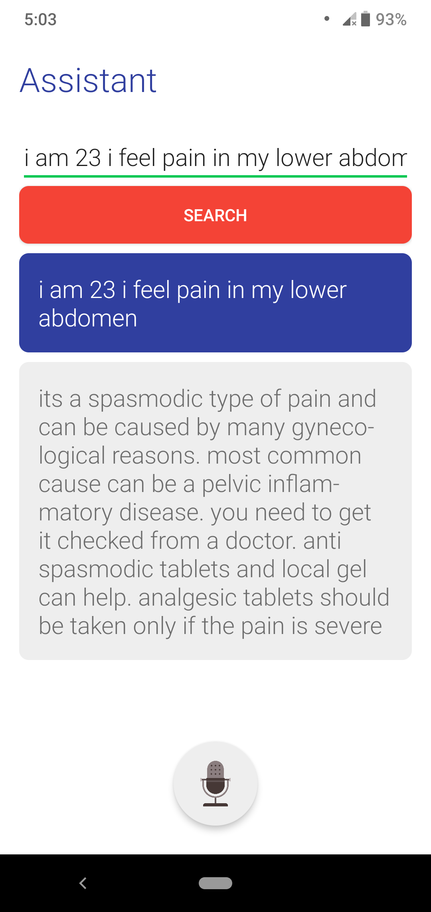
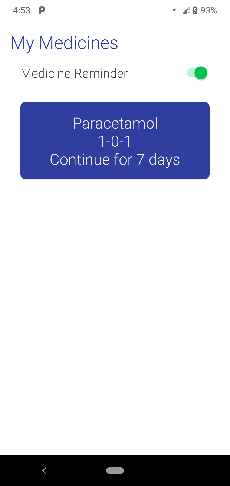
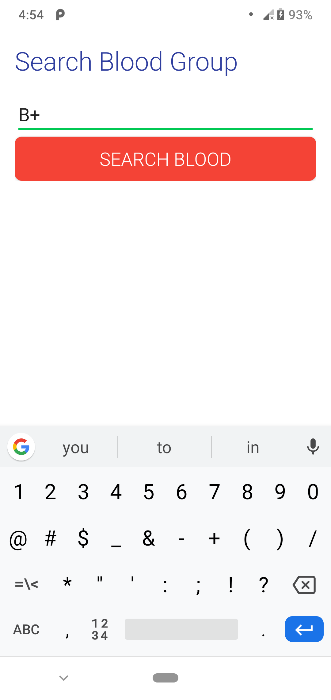
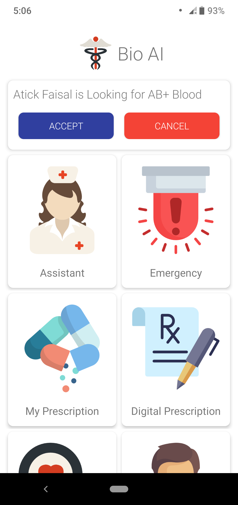
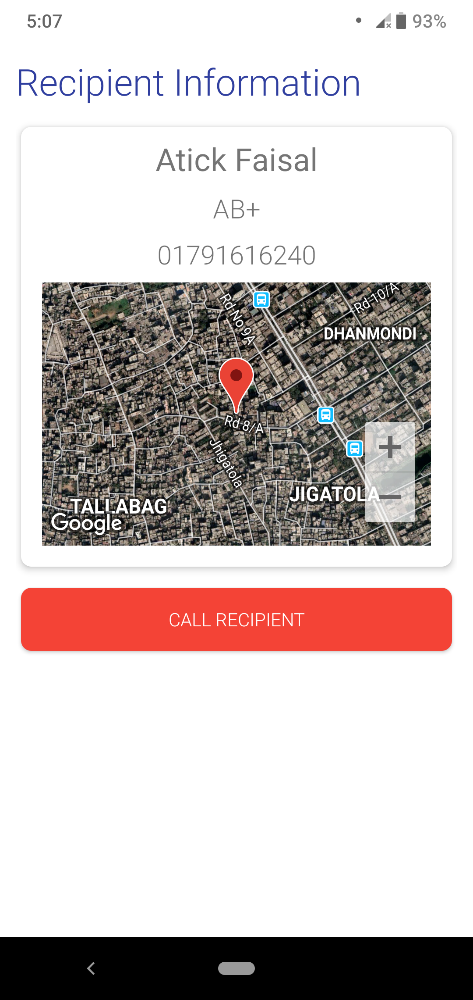

# Bio AI  
### An Artificial Intelligence based healthcare solution.

  
  
  
  

#### 1. AI based Diagnosis
Ask the `Assistant` about your symptoms. It will provide an AI generated diagnosis. More about the AI can be found here...
 
<a href="https://github.com/re-search/DocProduct">Go to DocProduct Github</a>

  
  
  

#### 2. Digital Prescription System
Automated `Prescription` system with medicine reminder.

  
  

#### 3. Blood Bank
Search for `Blood` among the App users.

  
  
  

#### 4. Emergency Contact
Immediately send your location for help in case of an `Emergency`

  

<h1>Author@Ritwik Biswas</h1>

## License

This work is licensed under [GNU General Public License v3.0](https://github.com/atick-faisal/PIC16F877a/blob/master/LICENSE). 
